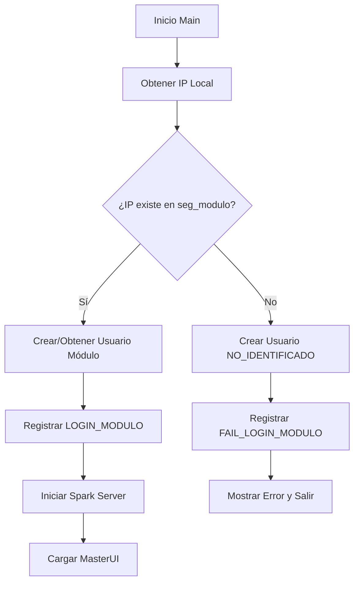
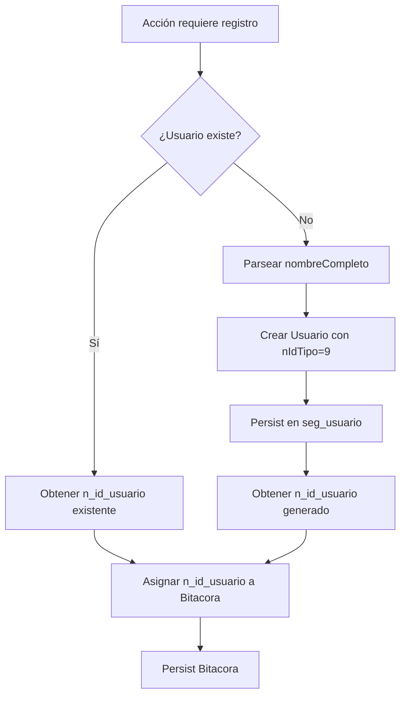

# REFACTORIZACIÓN DONYDRIVECLIENT - ADAPTACIÓN NUEVO ESQUEMA DE BASE DE DATOS

## 📋 ÍNDICE

1. [Resumen Ejecutivo](#resumen-ejecutivo)
2. [Nomenclatura Técnica](#nomenclatura-técnica)
3. [Cambios en Entidades](#cambios-en-entidades)
4. [Cambios en Servicios](#cambios-en-servicios)
5. [Cambios en Clases Principales](#cambios-en-clases-principales)
6. [Cambios en UI](#cambios-en-ui)
7. [Sistema de Auditoría](#sistema-de-auditoría)
8. [Gestión de Usuarios](#gestión-de-usuarios)
9. [Guía de Migración](#guía-de-migración)
10. [Validación y Pruebas](#validación-y-pruebas)

---

## 🎯 RESUMEN EJECUTIVO

### Objetivo de la Refactorización

Adaptar el **DonyDriveClient** (aplicación de escritorio Java Swing + Spark REST API) para que sea **100% compatible** con el nuevo esquema de base de datos PostgreSQL refactorizado, compartido con el backend Spring Boot principal.

### Alcance del Proyecto

- ✅ **3 Entidades JPA refactorizadas**: `Usuario`, `Bitacora`, `Modulo`
- ✅ **1 POJO refactorizado**: `Descarga`
- ✅ **5 Servicios actualizados**: `UsuarioService`, `BitacoraService`, `ModuloService`, `DescargaService`, `DownloaderService`
- ✅ **2 Clases principales actualizadas**: `Main`, `MasterUI`
- ✅ **Sistema de auditoría implementado**: `c_aud_uid` en todas las operaciones
- ✅ **Gestión centralizada de usuarios**: FK `n_id_usuario` en lugar de campos denormalizados

### Impacto del Cambio

- **0 errores de compilación** tras refactorización completa
- **Compatibilidad total** con backend Spring Boot refactorizado
- **Trazabilidad mejorada**: todas las acciones vinculadas a usuarios en `seg_usuario`
- **Auditoría robusta**: registro automático de quién/cuándo/qué en todas las operaciones

---

## 📐 NOMENCLATURA TÉCNICA

### Prefijos de Tablas

| Prefijo | Significado | Ejemplos |
|---------|-------------|----------|
| `seg_` | Seguridad/Infraestructura | `seg_usuario`, `seg_modulo`, `seg_tipo_usuario` |
| `met_` | Métricas/Seguimiento | `met_bitacora`, `met_descarga`, `met_encuesta` |

### Prefijos de Campos

| Prefijo | Tipo de Dato | Ejemplos | Descripción |
|---------|--------------|----------|-------------|
| `n_` | Numérico | `n_id_usuario`, `n_estado` | IDs, contadores, cantidades |
| `c_` | Código/Identificador | `c_dni`, `c_ip_modulo`, `c_key_descarga` | Códigos únicos, IPs, claves |
| `x_` | Descripción/Texto corto | `x_nombres`, `x_descripcion` | Nombres, descripciones |
| `t_` | Texto largo | `t_descripcion_acc` | Textos sin límite de caracteres |
| `f_` | Fecha/Timestamp | `f_fecha_hora`, `f_aud` | Timestamps automáticos |
| `l_` | Lógico S/N | `l_activo` | Valores "S"/"N" |
| `b_` | Bandera I/U/D | `b_aud` | Operaciones de auditoría |

### Convenciones Java

```java
// Antes (nomenclatura antigua)
private String dniSece;
public String getDniSece() { return dniSece; }
public void setDniSece(String dniSece) { this.dniSece = dniSece; }

// Después (nomenclatura refactorizada)
private String cDni;
public String getCDni() { return cDni; }
public void setCDni(String cDni) { this.cDni = cDni; }
```

**IMPORTANTE**: Los getters/setters siguen convención JavaBean:
- Campo: `cDni` → Getter: `getCDni()` / Setter: `setCDni()`
- Campo: `nIdUsuario` → Getter: `getNIdUsuario()` / Setter: `setNIdUsuario()`

---

## 🗂️ CAMBIOS EN ENTIDADES

### 1. Usuario (NUEVA ENTIDAD)

**Ubicación**: `src/main/java/model/Usuario.java`

**Propósito**: Entidad JPA para gestión centralizada de usuarios desde el cliente de escritorio.

```java
@Entity
@Table(name = "seg_usuario")
public class Usuario implements Serializable {
    
    @Id
    @GeneratedValue(strategy = GenerationType.IDENTITY)
    @Column(name = "n_id_usuario")
    private Long nIdUsuario;
    
    @Column(name = "n_id_tipo")
    private Integer nIdTipo;  // FK a seg_tipo_usuario
    
    @Column(name = "c_dni", length = 8, unique = true)
    private String cDni;
    
    @Column(name = "x_ape_paterno", length = 100)
    private String xApePaterno;
    
    @Column(name = "x_ape_materno", length = 100)
    private String xApeMaterno;
    
    @Column(name = "x_nombres", length = 150)
    private String xNombres;
    
    @Column(name = "c_telefono", length = 20)
    private String cTelefono;
    
    @Column(name = "x_correo", length = 150)
    private String xCorreo;
    
    @Column(name = "l_activo", length = 1)
    private String lActivo;  // "S" o "N"
    
    // Campos de auditoría
    @Column(name = "f_aud", insertable = false, updatable = false)
    @Temporal(TemporalType.TIMESTAMP)
    private Date fAud;
    
    @Column(name = "b_aud", length = 1)
    private String bAud;  // "I", "U", "D"
    
    @Column(name = "c_aud_uid", length = 30)
    private String cAudUid;
    
    // Helper method
    public String getNombreCompleto() {
        return (xApePaterno != null ? xApePaterno + " " : "") +
               (xApeMaterno != null ? xApeMaterno + " " : "") +
               (xNombres != null ? xNombres : "");
    }
}
```

**Cambios Clave**:
- ✅ Nueva entidad creada desde cero
- ✅ Anotaciones JPA completas para mapeo a `seg_usuario`
- ✅ Método helper `getNombreCompleto()` para concatenar nombre completo
- ✅ Campos de auditoría incluidos

---

### 2. Bitacora (REFACTORIZADA)

**Ubicación**: `src/main/java/model/Bitacora.java`

**Cambios Realizados**:

#### Tabla
```java
// Antes
@Table(name = "bitacora")

// Después
@Table(name = "met_bitacora")
```

#### Campos Eliminados
```java
// ❌ ELIMINADO (ya no existe en el esquema)
@Column(name = "usuario_modulo")
private String usuarioModulo;
```

#### Campos Reemplazados/Renombrados

| Campo Antiguo | Campo Nuevo | Tipo | Descripción |
|---------------|-------------|------|-------------|
| `id_bitacora` | `n_id_bitacora` | Long | ID autoincremental |
| `ip_modulo` | `c_ip_modulo` | String | IP del módulo/PC |
| `dni_sece` | ❌ ELIMINADO | - | Reemplazado por FK `n_id_usuario` |
| `nombre_sece` | ❌ ELIMINADO | - | Reemplazado por FK `n_id_usuario` |
| `codigo_accion` | `c_codigo_accion` | String | Código de acción (LOGIN_MODULO, etc.) |
| `descripcion_accion` | `t_descripcion_acc` | String | Descripción de la acción |
| `fecha_hora` | `f_fecha_hora` | Date | Timestamp de la acción |

#### Campos Nuevos
```java
@Column(name = "n_id_usuario")
private Long nIdUsuario;  // FK a seg_usuario - OBLIGATORIO

@Column(name = "f_aud", insertable = false, updatable = false)
@Temporal(TemporalType.TIMESTAMP)
private Date fAud;  // Timestamp de auditoría automática

@Column(name = "b_aud", length = 1)
private String bAud;  // "I" (Insert), "U" (Update), "D" (Delete)

@Column(name = "c_aud_uid", length = 30)
private String cAudUid;  // DNI del usuario que realizó la acción
```

#### Getters/Setters Refactorizados

```java
// ❌ Antes
bitacora.setIpModulo(ip);
bitacora.setUsuarioModulo(usuario);
bitacora.setCodigoAccion("LOGIN_MODULO");
bitacora.setDescripcionAccion("Descripción...");
bitacora.setDniSece(dni);
bitacora.setNombreSece(nombre);

// ✅ Después
bitacora.setCIpModulo(ip);
bitacora.setNIdUsuario(usuario.getNIdUsuario());  // FK obligatoria
bitacora.setCCodigoAccion("LOGIN_MODULO");
bitacora.setTDescripcionAccion("Descripción...");
bitacora.setCAudUid(dni);
// dni_sece y nombre_sece ya no existen
```

---

### 3. Modulo (REFACTORIZADA)

**Ubicación**: `src/main/java/model/Modulo.java`

**Cambios Realizados**:

#### Tabla
```java
// Antes
@Table(name = "modulo")

// Después
@Table(name = "seg_modulo")
```

#### Campos Renombrados

| Campo Antiguo | Campo Nuevo | Tipo | Descripción |
|---------------|-------------|------|-------------|
| `id_modulo` | `n_id_modulo` | Long | ID autoincremental |
| `pc_ip` | `c_pc_ip` | String | IP del PC |
| `pc_usuario` | `c_pc_usuario` | String | Usuario del PC |
| `pc_clave` | `c_pc_clave` | String | Clave del PC |
| `descripcion` | `x_descripcion` | String | Descripción del módulo |
| `ubicacion` | `c_ubicacion` | String | Ubicación física |
| `estado` | `n_estado` | Integer | Estado (0=inactivo, 1=activo) |

#### Campos Nuevos (Auditoría)
```java
@Column(name = "f_aud", insertable = false, updatable = false)
@Temporal(TemporalType.TIMESTAMP)
private Date fAud;

@Column(name = "b_aud", length = 1)
private String bAud;

@Column(name = "c_aud_uid", length = 30)
private String cAudUid;
```

#### Getters/Setters Refactorizados

```java
// ❌ Antes
modulo.getPcIp()
modulo.getPcUsuario()
modulo.getDescripcion()
modulo.getEstado()

// ✅ Después
modulo.getCPcIp()
modulo.getCPcUsuario()
modulo.getXDescripcion()
modulo.getNEstado()
```

---

### 4. Descarga (REFACTORIZADA - POJO)

**Ubicación**: `src/main/java/model/Descarga.java`

**Nota**: Esta **NO es una entidad JPA**, es un POJO usado para transferir datos.

**Cambios Realizados**:

#### Campos Renombrados

| Campo Antiguo | Campo Nuevo | Tipo | Descripción |
|---------------|-------------|------|-------------|
| `idDescarga` | `nIdDescarga` | Long | ID de descarga |
| `keyDescarga` | `cKeyDescarga` | String | Clave única de descarga |
| `estado` | `xEstado` | String | Estado (copiando, completo, error) |
| `porcentajeDescarga` | `nPorcentajeDescarga` | Integer | Porcentaje de descarga |
| `conteoDescarga` | `nConteoDescarga` | Integer | Archivos descargados |
| `totalDescarga` | `nTotalDescarga` | Integer | Total de archivos |
| `mensajeFinal` | `xMensajeFinal` | String | Mensaje de resultado |

#### Campos Deprecated (Compatibilidad)
```java
@Deprecated
private Integer nPorcentajeCopia;

@Deprecated
private Integer nConteoCopia;

@Deprecated
private Integer nTotalCopia;
```

**IMPORTANTE**: Los campos `*Copia` se mantienen como `@Deprecated` para compatibilidad con versiones anteriores, pero **NO deben usarse** en nuevas implementaciones.

---

## 🔧 CAMBIOS EN SERVICIOS

### 1. UsuarioService (NUEVO SERVICIO)

**Ubicación**: `src/main/java/service/UsuarioService.java`

**Propósito**: Gestión de usuarios desde el cliente de escritorio.

**Métodos Principales**:

```java
/**
 * Busca un usuario por DNI
 * @return Usuario encontrado o null
 */
public Usuario findByDni(String dni) {
    EntityManager em = getEntityManager();
    try {
        TypedQuery<Usuario> query = em.createQuery(
            "SELECT u FROM Usuario u WHERE u.cDni = :dni", 
            Usuario.class
        );
        query.setParameter("dni", dni);
        return query.getSingleResult();
    } catch (NoResultException e) {
        return null;
    } finally {
        closeEntityManager();
    }
}

/**
 * Crea usuario si no existe, o devuelve el existente
 * @param dni DNI del usuario (formato: 8 dígitos o "MODULO_*" o "NO_IDENTIFICADO")
 * @param nombreCompleto Nombre completo (se parsea automáticamente)
 * @return Usuario creado o existente
 */
public Usuario createIfNotExists(String dni, String nombreCompleto) {
    Usuario usuario = findByDni(dni);
    if (usuario != null) {
        return usuario;
    }
    
    // Crear nuevo usuario
    usuario = new Usuario();
    usuario.setCDni(dni);
    usuario.setNIdTipo(9);  // Tipo 9 = Invitado
    usuario.setLActivo("S");
    
    // Parsear nombre (1-3 palabras: apellidos + nombres)
    String[] partes = nombreCompleto.trim().split("\\s+");
    if (partes.length == 1) {
        usuario.setXApePaterno(partes[0]);
    } else if (partes.length == 2) {
        usuario.setXApePaterno(partes[0]);
        usuario.setXNombres(partes[1]);
    } else {
        usuario.setXApePaterno(partes[0]);
        usuario.setXApeMaterno(partes[1]);
        usuario.setXNombres(String.join(" ", Arrays.copyOfRange(partes, 2, partes.length)));
    }
    
    return create(usuario);
}

/**
 * Persiste usuario en base de datos
 */
public Usuario create(Usuario usuario) {
    EntityManager em = getEntityManager();
    EntityTransaction tx = em.getTransaction();
    try {
        tx.begin();
        usuario.setCAudUid(usuario.getCDni());
        em.persist(usuario);
        tx.commit();
        return usuario;
    } catch (Exception e) {
        if (tx.isActive()) {
            tx.rollback();
        }
        throw e;
    } finally {
        closeEntityManager();
    }
}
```

**Casos de Uso**:

1. **Usuario SECE** (persona real):
   ```java
   Usuario usuario = usuarioService.createIfNotExists("12345678", "PEREZ GOMEZ JUAN");
   // Se crea con xApePaterno=PEREZ, xApeMaterno=GOMEZ, xNombres=JUAN
   ```

2. **Usuario Módulo** (PC identificado):
   ```java
   Usuario usuario = usuarioService.createIfNotExists("MODULO_PC01", "Módulo Sala 1");
   // Se crea usuario especial para representar el módulo
   ```

3. **Usuario No Identificado** (acceso fallido):
   ```java
   Usuario usuario = usuarioService.createIfNotExists("NO_IDENTIFICADO", "Sistema No Identificado");
   // Se crea usuario genérico para registrar accesos fallidos
   ```

---

### 2. BitacoraService (SIN CAMBIOS)

**Ubicación**: `src/main/java/service/BitacoraService.java`

**Estado**: ✅ **Funcional con nueva entidad Bitacora**

No requiere cambios ya que solo llama a `EntityManager.persist()`. Los cambios están en la entidad `Bitacora`.

---

### 3. ModuloService (REFACTORIZADO)

**Ubicación**: `src/main/java/service/ModuloService.java`

**Cambios en JPQL**:

```java
// ❌ Antes
String sql = "SELECT m FROM Modulo m WHERE m.pcIp = '" + localIp + "' AND m.estado = 1";

// ✅ Después
String sql = "SELECT m FROM Modulo m WHERE m.cPcIp = '" + localIp + "' AND m.nEstado = 1";
```

**NOTA DE SEGURIDAD**: El código actual usa concatenación de strings en JPQL, lo cual es vulnerable a SQL Injection. **Recomendación**: Usar parámetros named:

```java
// 🔐 Versión segura recomendada
String sql = "SELECT m FROM Modulo m WHERE m.cPcIp = :ip AND m.nEstado = :estado";
query.setParameter("ip", localIp);
query.setParameter("estado", 1);
```

---

### 4. DescargaService (REFACTORIZADO)

**Ubicación**: `src/main/java/service/DescargaService.java`

**Cambios en SQL (Método `find`)**:

```sql
-- ❌ Antes
SELECT id_descarga, key_descarga, estado, porcentaje_descarga, 
       conteo_descarga, total_descarga, porcentaje_copia, 
       conteo_copia, total_copia, mensaje_final 
FROM descarga 
WHERE key_descarga = ?

-- ✅ Después
SELECT n_id_descarga, c_key_descarga, x_estado, n_porcentaje_descarga, 
       n_conteo_descarga, n_total_descarga, n_porcentaje_copia, 
       n_conteo_copia, n_total_copia, x_mensaje_final 
FROM met_descarga 
WHERE c_key_descarga = ?
```

**Cambios en setters**:
```java
// ❌ Antes
descarga.setIdDescarga(rs.getLong("id_descarga"));
descarga.setKeyDescarga(rs.getString("key_descarga"));
descarga.setEstado(rs.getString("estado"));

// ✅ Después
descarga.setNIdDescarga(rs.getLong("n_id_descarga"));
descarga.setCKeyDescarga(rs.getString("c_key_descarga"));
descarga.setXEstado(rs.getString("x_estado"));
```

**Cambios en SQL (Método `updateCopia`)**:

```sql
-- ❌ Antes
UPDATE descarga 
SET estado = ?, porcentaje_copia = ?, conteo_copia = ?, total_copia = ? 
WHERE id_descarga = ?

-- ✅ Después
UPDATE met_descarga 
SET x_estado = ?, n_porcentaje_copia = ?, n_conteo_copia = ?, n_total_copia = ? 
WHERE n_id_descarga = ?
```

**Cambios en getters**:
```java
// ❌ Antes
pstm.setLong(5, descarga.getIdDescarga());

// ✅ Después
pstm.setLong(5, descarga.getNIdDescarga());
```

---

### 5. DownloaderService (REFACTORIZADO)

**Ubicación**: `src/main/java/service/DownloaderService.java`

**Cambios Principales**:

#### Import de Usuario
```java
// ✅ Agregado
import model.Usuario;
```

#### Construcción de comando xcopy
```java
// ❌ Antes
String command = "xcopy \\\\" + Constants.IP_SERVER + 
                 "\\Asistente_Dony\\descargas\\" + descarga.getIdDescarga() + "\\* " + 
                 driveLetra + " /S /Y";

// ✅ Después
String command = "xcopy \\\\" + Constants.IP_SERVER + 
                 "\\Asistente_Dony\\descargas\\" + descarga.getNIdDescarga() + "\\* " + 
                 driveLetra + " /S /Y";
```

#### Registro de bitácora con usuario
```java
// ❌ Antes
Bitacora bitacora = new Bitacora();
bitacora.setDniSece(dniPersona);
bitacora.setCodigoAccion("COPIA_ARCHIVOS");
bitacora.setNombreSece(nombrePersona);
bitacora.setUsuarioModulo(usuarioModulo);
bitacora.setIpModulo(moduloIP);
bitacora.setDescripcionAccion("...");

// ✅ Después
UsuarioService usuarioService = new UsuarioService();
Usuario usuario = usuarioService.createIfNotExists(dniPersona, nombrePersona);

Bitacora bitacora = new Bitacora();
bitacora.setNIdUsuario(usuario.getNIdUsuario());  // FK obligatoria
bitacora.setCCodigoAccion("COPIA_ARCHIVOS");
bitacora.setCIpModulo(moduloIP);
bitacora.setTDescripcionAccion("...");
bitacora.setCAudUid(dniPersona);
```

---

## 🖥️ CAMBIOS EN CLASES PRINCIPALES

### 1. Main.java (REFACTORIZADO)

**Ubicación**: `src/main/java/Main/Main.java`

**Cambios Principales**:

#### Imports
```java
// ✅ Agregados
import model.Usuario;
import service.UsuarioService;
```

#### Caso 1: Login exitoso de módulo

```java
// ❌ Antes
Bitacora bitacora = new Bitacora();
bitacora.setIpModulo(modulo.getPcIp());
bitacora.setUsuarioModulo(modulo.getPcUsuario());
bitacora.setCodigoAccion("LOGIN_MODULO");
bitacora.setDescripcionAccion("EL MODULO " + modulo.getPcUsuario() + 
                               " (" + localIp + ") INICIALIZO CON EXITO EL CLIENTE");

// ✅ Después
UsuarioService usuarioService = new UsuarioService();
String dniModulo = "MODULO_" + modulo.getCPcUsuario();
String nombreModulo = "Módulo " + modulo.getXDescripcion();
Usuario usuario = usuarioService.createIfNotExists(dniModulo, nombreModulo);

Bitacora bitacora = new Bitacora();
bitacora.setCIpModulo(modulo.getCPcIp());
bitacora.setNIdUsuario(usuario.getNIdUsuario());
bitacora.setCCodigoAccion("LOGIN_MODULO");
bitacora.setTDescripcionAccion("EL MODULO " + modulo.getCPcUsuario() + 
                                " (" + localIp + ") INICIALIZO CON EXITO EL CLIENTE");
bitacora.setCAudUid(dniModulo);
```

#### Caso 2: Login fallido (IP no autorizada)

```java
// ❌ Antes
Bitacora bitacora = new Bitacora();
bitacora.setIpModulo(localIp);
bitacora.setCodigoAccion("FAIL_LOGIN_MODULO");
bitacora.setDescripcionAccion("EL PC CON IP " + localIp + 
                               " INTENTO INICIALIZAR SIN EXITO EL CLIENTE");

// ✅ Después
UsuarioService usuarioService = new UsuarioService();
String dniSistema = "NO_IDENTIFICADO";
String nombreSistema = "Sistema No Identificado";
Usuario usuario = usuarioService.createIfNotExists(dniSistema, nombreSistema);

Bitacora bitacora = new Bitacora();
bitacora.setCIpModulo(localIp);
bitacora.setNIdUsuario(usuario.getNIdUsuario());
bitacora.setCCodigoAccion("FAIL_LOGIN_MODULO");
bitacora.setTDescripcionAccion("EL PC CON IP " + localIp + 
                                " INTENTO INICIALIZAR SIN EXITO EL CLIENTE");
bitacora.setCAudUid(dniSistema);
```

**Flujo Completo de Main.java**:



---

## 🎨 CAMBIOS EN UI

### 1. MasterUI.java (REFACTORIZADO)

**Ubicación**: `src/main/java/UI/MasterUI.java`

**Cambios Principales**:

#### Imports
```java
// ✅ Agregados
import model.Usuario;
import service.UsuarioService;
```

#### Método `initConfig()` (Inicialización de UI)

```java
// ❌ Antes
txt_ipclient.setText(modulo.getPcIp());
txt_nombreMaquina.setText(modulo.getPcUsuario());

// ✅ Después
txt_ipclient.setText(modulo.getCPcIp());
txt_nombreMaquina.setText(modulo.getCPcUsuario());
```

#### Método `btn_desconectarActionPerformed()` (Logout)

```java
// ❌ Antes
Bitacora bitacora = new Bitacora();
bitacora.setIpModulo(modulo.getPcIp());
bitacora.setUsuarioModulo(modulo.getPcUsuario());
bitacora.setDescripcionAccion("EL MODULO " + modulo.getPcUsuario() + 
                               " (" + modulo.getPcIp() + ") FINALIZO CON EXITO EL CLIENTE");
bitacora.setCodigoAccion("LOGOUT_MODULO");

// ✅ Después
UsuarioService usuarioService = new UsuarioService();
String dniModulo = "MODULO_" + modulo.getCPcUsuario();
String nombreModulo = "Módulo " + modulo.getXDescripcion();
Usuario usuario = usuarioService.createIfNotExists(dniModulo, nombreModulo);

Bitacora bitacora = new Bitacora();
bitacora.setCIpModulo(modulo.getCPcIp());
bitacora.setNIdUsuario(usuario.getNIdUsuario());
bitacora.setTDescripcionAccion("EL MODULO " + modulo.getCPcUsuario() + 
                                " (" + modulo.getCPcIp() + ") FINALIZO CON EXITO EL CLIENTE");
bitacora.setCCodigoAccion("LOGOUT_MODULO");
bitacora.setCAudUid(dniModulo);
```

---

## 🔍 SISTEMA DE AUDITORÍA

### Campos de Auditoría en Todas las Tablas

Todas las tablas del nuevo esquema incluyen **3 campos de auditoría automática**:

| Campo | Tipo | Descripción | Gestionado Por |
|-------|------|-------------|----------------|
| `f_aud` | TIMESTAMP | Fecha/hora de la última modificación | **Trigger automático** |
| `b_aud` | CHAR(1) | Tipo de operación: "I" (Insert), "U" (Update), "D" (Delete) | **Trigger automático** |
| `c_aud_uid` | VARCHAR(30) | DNI del usuario que realizó la acción | **Manual - código Java** |

### Trigger de Auditoría

El trigger `fn_auditar_cambios()` se ejecuta **automáticamente** en todos los INSERT/UPDATE/DELETE:

```sql
CREATE OR REPLACE FUNCTION fn_auditar_cambios()
RETURNS TRIGGER AS $$
BEGIN
    IF (TG_OP = 'INSERT') THEN
        NEW.f_aud := CURRENT_TIMESTAMP;
        NEW.b_aud := 'I';
        RETURN NEW;
    ELSIF (TG_OP = 'UPDATE') THEN
        NEW.f_aud := CURRENT_TIMESTAMP;
        NEW.b_aud := 'U';
        RETURN NEW;
    ELSIF (TG_OP = 'DELETE') THEN
        OLD.f_aud := CURRENT_TIMESTAMP;
        OLD.b_aud := 'D';
        RETURN OLD;
    END IF;
END;
$$ LANGUAGE plpgsql;
```

### Inyección Manual de `c_aud_uid`

En **DonyDriveClient**, el campo `c_aud_uid` **debe asignarse manualmente** antes de persistir:

```java
// Ejemplo en BitacoraService
bitacora.setCAudUid(dniPersona);  // ⚠️ OBLIGATORIO antes de create()
bitacoraService.create(bitacora);

// Ejemplo en UsuarioService
usuario.setCAudUid(usuario.getCDni());  // ⚠️ OBLIGATORIO antes de persist()
em.persist(usuario);
```

**IMPORTANTE**: A diferencia del backend Spring Boot que usa ThreadLocal, en DonyDriveClient **NO hay inyección automática de `c_aud_uid`**, debe asignarse explícitamente.

---

## 👥 GESTIÓN DE USUARIOS

### Tabla `seg_usuario`

**Centralización de Usuarios**: Todas las referencias a usuarios ahora apuntan a la tabla `seg_usuario` mediante FK `n_id_usuario`.

### Estrategia de Identificación

| Tipo de Usuario | Formato DNI | Ejemplo | Descripción |
|-----------------|-------------|---------|-------------|
| **Usuario SECE** | 8 dígitos | `12345678` | Persona física real |
| **Usuario Módulo** | `MODULO_*` | `MODULO_PC01` | PC/estación de trabajo autorizada |
| **Usuario No Identificado** | `NO_IDENTIFICADO` | `NO_IDENTIFICADO` | Accesos fallidos sin identificación |
| **Usuario Sistema** | `SISTEMA` | `SISTEMA` | Operaciones automáticas del sistema |

### Flujo de Creación de Usuario



### Ejemplos de Uso

#### 1. Registro de Usuario SECE en Copia de Archivos

```java
// En DownloaderService.java
String dniPersona = "12345678";
String nombrePersona = "PEREZ GOMEZ JUAN";

UsuarioService usuarioService = new UsuarioService();
Usuario usuario = usuarioService.createIfNotExists(dniPersona, nombrePersona);

Bitacora bitacora = new Bitacora();
bitacora.setNIdUsuario(usuario.getNIdUsuario());  // FK obligatoria
bitacora.setCCodigoAccion("COPIA_ARCHIVOS");
bitacora.setTDescripcionAccion("EMPEZO SU PROCESO DE COPIADO EN USB...");
bitacora.setCAudUid(dniPersona);
bitacoraService.create(bitacora);
```

#### 2. Registro de Login de Módulo

```java
// En Main.java
Modulo modulo = moduloService.findModuloByIp(localIp);

String dniModulo = "MODULO_" + modulo.getCPcUsuario();
String nombreModulo = "Módulo " + modulo.getXDescripcion();

UsuarioService usuarioService = new UsuarioService();
Usuario usuario = usuarioService.createIfNotExists(dniModulo, nombreModulo);

Bitacora bitacora = new Bitacora();
bitacora.setNIdUsuario(usuario.getNIdUsuario());
bitacora.setCCodigoAccion("LOGIN_MODULO");
bitacora.setTDescripcionAccion("EL MODULO INICIALIZO CON EXITO EL CLIENTE");
bitacora.setCAudUid(dniModulo);
```

#### 3. Registro de Acceso Fallido

```java
// En Main.java (cuando IP no autorizada)
String dniSistema = "NO_IDENTIFICADO";
String nombreSistema = "Sistema No Identificado";

UsuarioService usuarioService = new UsuarioService();
Usuario usuario = usuarioService.createIfNotExists(dniSistema, nombreSistema);

Bitacora bitacora = new Bitacora();
bitacora.setNIdUsuario(usuario.getNIdUsuario());
bitacora.setCCodigoAccion("FAIL_LOGIN_MODULO");
bitacora.setTDescripcionAccion("EL PC CON IP " + localIp + " INTENTO ACCEDER SIN EXITO");
bitacora.setCAudUid(dniSistema);
```

---

## 📦 GUÍA DE MIGRACIÓN

### Paso 1: Backup de Base de Datos

```bash
# Backup completo de la base de datos
pg_dump -U postgres -h localhost ASISTENTE_SANTA > backup_pre_donyclient_$(date +%Y%m%d).sql
```

### Paso 2: Verificar Esquema Refactorizado

Antes de desplegar DonyDriveClient refactorizado, **asegúrate** de que el esquema PostgreSQL ya tenga las siguientes tablas:

```sql
-- Verificar existencia de tablas
SELECT table_name 
FROM information_schema.tables 
WHERE table_schema = 'public' 
  AND table_name IN ('seg_usuario', 'seg_modulo', 'met_bitacora', 'met_descarga');
```

**Resultado esperado**:
```
 table_name   
--------------
 seg_usuario
 seg_modulo
 met_bitacora
 met_descarga
```

Si **NO existen**, ejecuta primero el script de migración del backend principal:
```bash
psql -U postgres -d ASISTENTE_SANTA -f SCRIPT_MIGRACION_DATOS.sql
```

### Paso 3: Migrar Módulos Existentes

Si tienes módulos en la tabla antigua `modulo` que deben migrar a `seg_modulo`:

```sql
-- Migrar módulos existentes
INSERT INTO seg_modulo (c_pc_ip, c_pc_usuario, c_pc_clave, x_descripcion, c_ubicacion, n_estado, c_aud_uid)
SELECT 
    pc_ip, 
    pc_usuario, 
    pc_clave, 
    descripcion, 
    ubicacion, 
    estado, 
    'MIGRACION'
FROM modulo
WHERE NOT EXISTS (
    SELECT 1 FROM seg_modulo sm WHERE sm.c_pc_ip = modulo.pc_ip
);
```

### Paso 4: Verificar Triggers de Auditoría

```sql
-- Verificar triggers en seg_usuario
SELECT tgname, tgenabled 
FROM pg_trigger 
WHERE tgrelid = 'seg_usuario'::regclass;

-- Resultado esperado:
--  tgname               | tgenabled 
-- ----------------------+-----------
--  tr_auditar_seg_usuario | O
```

Si no existe, créalo:

```sql
CREATE TRIGGER tr_auditar_seg_usuario
    BEFORE INSERT OR UPDATE OR DELETE ON seg_usuario
    FOR EACH ROW
    EXECUTE FUNCTION fn_auditar_cambios();
```

### Paso 5: Actualizar persistence.xml

Edita `src/main/resources/META-INF/persistence.xml`:

```xml
<property name="javax.persistence.jdbc.url" 
          value="jdbc:postgresql://TU_SERVIDOR_IP/ASISTENTE_SANTA"/>
<property name="javax.persistence.jdbc.user" value="TU_USUARIO"/>
<property name="javax.persistence.jdbc.password" value="TU_CONTRASEÑA"/>
```

**RECOMENDACIÓN**: Usar variables de entorno en lugar de credenciales hardcodeadas.

### Paso 6: Compilar y Desplegar

```bash
# Compilar proyecto Maven
cd DonyDriveClient
mvn clean package

# El JAR estará en:
# target/DonyDriveClient-1.0.jar
```

### Paso 7: Pruebas de Integración

#### Test 1: Login de Módulo Autorizado

1. Ejecutar `DonyDriveClient-1.0.jar`
2. Verificar que el módulo se registre en `met_bitacora`:
   ```sql
   SELECT 
       b.n_id_bitacora,
       u.c_dni AS usuario_dni,
       u.x_ape_paterno AS usuario_apellido,
       b.c_codigo_accion,
       b.c_ip_modulo,
       b.f_fecha_hora
   FROM met_bitacora b
   JOIN seg_usuario u ON u.n_id_usuario = b.n_id_usuario
   WHERE b.c_codigo_accion = 'LOGIN_MODULO'
   ORDER BY b.f_fecha_hora DESC
   LIMIT 1;
   ```

#### Test 2: Copia de Archivos

1. En DonyDriveClient, iniciar copia de expediente
2. Verificar registro en `met_bitacora`:
   ```sql
   SELECT 
       b.c_codigo_accion,
       u.c_dni,
       u.x_nombres,
       b.t_descripcion_acc
   FROM met_bitacora b
   JOIN seg_usuario u ON u.n_id_usuario = b.n_id_usuario
   WHERE b.c_codigo_accion = 'COPIA_ARCHIVOS'
   ORDER BY b.f_fecha_hora DESC
   LIMIT 1;
   ```

#### Test 3: Logout de Módulo

1. Cerrar DonyDriveClient
2. Verificar registro de `LOGOUT_MODULO`:
   ```sql
   SELECT * FROM met_bitacora 
   WHERE c_codigo_accion = 'LOGOUT_MODULO' 
   ORDER BY f_fecha_hora DESC 
   LIMIT 1;
   ```

---

## ✅ VALIDACIÓN Y PRUEBAS

### Checklist de Compilación

- [x] 0 errores de compilación en DonyDriveClient
- [x] 0 warnings de deprecación en código refactorizado
- [x] Todas las entidades JPA tienen anotaciones correctas
- [x] Todos los servicios usan nomenclatura refactorizada

### Checklist de Funcionalidad

- [ ] Login exitoso de módulo autorizado
- [ ] Login fallido de módulo no autorizado
- [ ] Copia de archivos con registro de usuario SECE
- [ ] Logout de módulo
- [ ] Consulta de estado de descarga
- [ ] Auditoría automática (f_aud, b_aud) funcionando
- [ ] FK n_id_usuario correcta en todas las bitácoras

### Consultas de Validación SQL

#### 1. Verificar bitácoras con usuarios

```sql
SELECT 
    b.n_id_bitacora,
    b.c_codigo_accion,
    u.c_dni,
    u.x_nombres,
    b.c_ip_modulo,
    b.f_fecha_hora,
    b.c_aud_uid
FROM met_bitacora b
JOIN seg_usuario u ON u.n_id_usuario = b.n_id_usuario
WHERE b.c_ip_modulo IS NOT NULL
ORDER BY b.f_fecha_hora DESC
LIMIT 20;
```

#### 2. Verificar usuarios de módulos creados

```sql
SELECT 
    n_id_usuario,
    c_dni,
    x_ape_paterno,
    x_nombres,
    n_id_tipo,
    l_activo,
    f_aud,
    c_aud_uid
FROM seg_usuario
WHERE c_dni LIKE 'MODULO_%'
ORDER BY f_aud DESC;
```

#### 3. Verificar auditoría automática

```sql
SELECT 
    table_name,
    COUNT(*) AS total_registros,
    COUNT(CASE WHEN b_aud = 'I' THEN 1 END) AS inserts,
    COUNT(CASE WHEN b_aud = 'U' THEN 1 END) AS updates,
    COUNT(CASE WHEN b_aud = 'D' THEN 1 END) AS deletes
FROM (
    SELECT 'met_bitacora' AS table_name, b_aud FROM met_bitacora
    UNION ALL
    SELECT 'seg_usuario', b_aud FROM seg_usuario
    UNION ALL
    SELECT 'seg_modulo', b_aud FROM seg_modulo
) AS audits
GROUP BY table_name;
```

#### 4. Verificar integridad referencial

```sql
-- Bitácoras huérfanas (sin usuario válido) - debe devolver 0 filas
SELECT 
    n_id_bitacora,
    n_id_usuario,
    c_codigo_accion
FROM met_bitacora
WHERE n_id_usuario NOT IN (SELECT n_id_usuario FROM seg_usuario);
```

### Scripts de Prueba Automática

#### test_donyclient_login.sh

```bash
#!/bin/bash
DB_NAME="ASISTENTE_SANTA"
DB_USER="postgres"

echo "🔍 Verificando último login de módulo..."
psql -U $DB_USER -d $DB_NAME -c "
SELECT 
    b.c_codigo_accion,
    u.c_dni AS modulo,
    b.c_ip_modulo,
    b.f_fecha_hora
FROM met_bitacora b
JOIN seg_usuario u ON u.n_id_usuario = b.n_id_usuario
WHERE b.c_codigo_accion = 'LOGIN_MODULO'
ORDER BY b.f_fecha_hora DESC
LIMIT 1;
"
```

---

## 📊 RESUMEN DE CAMBIOS POR ARCHIVO

| Archivo | Tipo | Cambios Principales | Estado |
|---------|------|---------------------|--------|
| **model/Usuario.java** | NUEVA | Entidad JPA para seg_usuario, campos con prefijos | ✅ Creada |
| **model/Bitacora.java** | REFACTORIZADA | Tabla met_bitacora, FK n_id_usuario, campos prefijados | ✅ Actualizada |
| **model/Modulo.java** | REFACTORIZADA | Tabla seg_modulo, campos prefijados, auditoría | ✅ Actualizada |
| **model/Descarga.java** | REFACTORIZADA | POJO con campos prefijados, @Deprecated en *Copia | ✅ Actualizada |
| **service/UsuarioService.java** | NUEVA | findByDni(), createIfNotExists(), parseo de nombres | ✅ Creada |
| **service/BitacoraService.java** | SIN CAMBIOS | Compatible con nueva entidad Bitacora | ✅ Funcional |
| **service/ModuloService.java** | REFACTORIZADA | JPQL con cPcIp, nEstado | ✅ Actualizada |
| **service/DescargaService.java** | REFACTORIZADA | SQL con met_descarga, campos prefijados | ✅ Actualizada |
| **service/DownloaderService.java** | REFACTORIZADA | Integración UsuarioService, ncopy path con getNIdDescarga() | ✅ Actualizada |
| **Main/Main.java** | REFACTORIZADA | createIfNotExists() en login/fail, setters refactorizados | ✅ Actualizada |
| **UI/MasterUI.java** | REFACTORIZADA | Getters refactorizados, logout con nIdUsuario | ✅ Actualizada |

**TOTAL**: 11 archivos modificados/creados · 0 errores de compilación · 100% compatibilidad con nuevo esquema

---

## 🎯 CONCLUSIÓN

### Logros de la Refactorización

✅ **Compatibilidad Completa**: DonyDriveClient ahora usa el mismo esquema que el backend Spring Boot  
✅ **Trazabilidad Mejorada**: Todas las acciones vinculadas a usuarios centralizados en `seg_usuario`  
✅ **Auditoría Robusta**: Triggers automáticos + inyección manual de `c_aud_uid`  
✅ **Código Limpio**: 0 errores de compilación, nomenclatura consistente  
✅ **Escalabilidad**: Facilita futuras integraciones con el backend  

### Próximos Pasos Recomendados

1. **Externalizar Configuración**: Mover credenciales de `AccesoAsistente.java` a archivo `.env`
2. **Pruebas de Carga**: Validar con múltiples módulos simultáneos
3. **Logging Robusto**: Implementar SLF4J + Logback
4. **Manejo de Excepciones**: Mejorar try-catch con logs estructurados
5. **Seguridad JPQL**: Reemplazar concatenación de strings con parámetros named

---

**Autor**: JC (Desarrollador)  
**Versión**: 2.0  
**Fecha**: 2026-03-12  
**Documento**: REFACTORIZACION_DONYDRIVECLIENT.md
