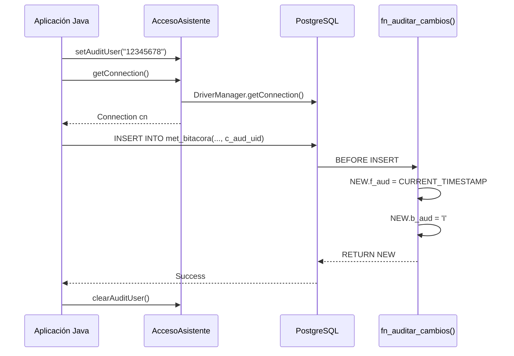

# Documentación de Refactorización - Sistema de Búsqueda Judicial
## Versión 2.0 - PostgreSQL Auditable

**Fecha:** 12 de marzo de 2026  
**Autor:** JC (Ingeniero de Software Senior)  
**GLPI:** 20260311  
**Base de Datos:** PostgreSQL 14+

---

## 📋 Tabla de Contenidos

1. [Resumen Ejecutivo](#resumen-ejecutivo)
2. [Cambios en el Esquema de Base de Datos](#cambios-en-el-esquema-de-base-de-datos)
3. [Refactorización de Código Java](#refactorización-de-código-java)
4. [Mapeo de Tablas y Campos](#mapeo-de-tablas-y-campos)
5. [Sistema de Auditoría](#sistema-de-auditoría)
6. [Guía de Migración](#guía-de-migración)
7. [Consideraciones de Compatibilidad](#consideraciones-de-compatibilidad)

---

## 1. Resumen Ejecutivo

### Objetivo
Refactorizar la capa de persistencia del sistema de búsqueda judicial para integrarla con una nueva base de datos PostgreSQL que implementa:
- Nomenclatura técnica estandarizada con prefijos
- Auditoría automática mediante triggers
- Separación entre módulos de seguridad (seg_) y métricas (met_)
- Configuración centralizada mediante variables de entorno

### Alcance
✅ **Incluido:**
- Refactorización del driver de base de datos
- Actualización de entidades JPA
- Modificación de servicios de persistencia
- Sistema de configuración con .env
- Soporte para auditoría automática

❌ **Excluido (Preservado):**
- Lógica de búsqueda semántica
- Algoritmos de IA
- Capa de presentación (Frontend)
- Servicios de SIJ (Sistemas Judiciales externos)

---

## 2. Cambios en el Esquema de Base de Datos

### 2.1 Nueva Nomenclatura de Prefijos

#### Prefijos de Tablas
| Prefijo | Significado | Ejemplos |
|---------|-------------|----------|
| `seg_`  | Seguridad   | seg_usuario, seg_modulo, seg_tipo_usuario |
| `met_`  | Métricas    | met_bitacora, met_encuesta, met_descarga, met_estadistica |

#### Prefijos de Campos
| Prefijo | Tipo de Dato | Descripción | Ejemplo |
|---------|--------------|-------------|---------|
| `n_`    | Número/Secuencia | IDs, contadores, cantidades | n_id_usuario, n_actas |
| `c_`    | Código | DNI, IP, identificadores alfanuméricos | c_dni, c_pc_ip |
| `x_`    | Descripción/Texto | Nombres, descripciones, textos cortos | x_nombres, x_descripcion |
| `t_`    | Texto Largo | Descripciones extensas, contenido no estructurado | t_descripcion_acc |
| `l_`    | Lógico/Indicador | Banderas S/N, activo/inactivo | l_activo |
| `f_`    | Fecha/Timestamp | Fechas, timestamps | f_fecha_hora, f_aud |
| `b_`    | Bandera | Tipo de operación (I/U/D) | b_aud |

### 2.2 Campos de Auditoría Estandarizados

Todas las tablas incluyen estos campos para auditoría automática:

```sql
f_aud              TIMESTAMPTZ DEFAULT CURRENT_TIMESTAMP  -- Fecha de auditoría
b_aud              CHAR(1) DEFAULT 'I'                    -- Tipo: I=Insert, U=Update, D=Delete
c_aud_uid          VARCHAR(30)                            -- Usuario que ejecuta la acción
```

**Triggers automáticos** gestionan `f_aud` y `b_aud`. La aplicación debe proporcionar `c_aud_uid`.

---

## 3. Refactorización de Código Java

### 3.1 Estructura de Archivos Creados/Modificados

```
asistente-expedientes-spring-main/
├── .env                                    [NUEVO] Archivo de configuración activa
├── .env.example                            [NUEVO] Plantilla de configuración
├── src/main/java/com/ncpp/asistenteexpedientes/
│   └── asistente/
│       ├── config/
│       │   └── DatabaseConfig.java         [NUEVO] Gestor de configuración
│       ├── database/
│       │   └── AccesoAsistente.java        [REFACTORIZADO] Driver de BD con auditoría
│       ├── entity/
│       │   ├── Usuario.java                [NUEVO] Entidad seg_usuario
│       │   ├── Modulo.java                 [REFACTORIZADO] seg_modulo
│       │   ├── Bitacora.java               [REFACTORIZADO] met_bitacora
│       │   ├── Descarga.java               [REFACTORIZADO] met_descarga
│       │   ├── Encuesta.java               [REFACTORIZADO] met_encuesta
│       │   └── Estadisticas.java           [REFACTORIZADO] met_estadistica
│       └── service/impl/
│           ├── BitacoraServiceImpl.java    [REFACTORIZADO] Con auditoría
│           ├── DescargaServiceImpl.java    [REFACTORIZADO] Nuevas queries
│           ├── EncuestaServiceImpl.java    [REFACTORIZADO] Con FK a seg_usuario
│           └── EstadisticasServiceImpl.java [REFACTORIZADO] Campo videos eliminado
```

### 3.2 DatabaseConfig - Configuración Centralizada

**Archivo:** `src/main/java/com/ncpp/asistenteexpedientes/asistente/config/DatabaseConfig.java`

**Características:**
- Patrón Singleton para instancia única
- Carga automática desde archivo `.env`
- Nomenclatura de variables: `gs_*` (global string) en .env → `ls_*` (local string) en clase
- Fallback a valores por defecto si .env no existe

**Uso:**
```java
DatabaseConfig config = DatabaseConfig.getInstance();
String url = config.getDbUrl();
String user = config.getDbUser();
String password = config.getDbPassword();
```

### 3.3 AccesoAsistente - Driver Refactorizado

**Archivo:** `src/main/java/com/ncpp/asistenteexpedientes/asistente/database/AccesoAsistente.java`

**Nuevas Funcionalidades:**

#### 3.3.1 Conexión con Configuración Dinámica
```java
Connection cn = AccesoAsistente.getConnection();
```
Lee credenciales desde `DatabaseConfig` en lugar de constantes hardcodeadas.

#### 3.3.2 Manejo de Contexto de Auditoría
```java
// Establecer usuario de auditoría para el hilo actual
AccesoAsistente.setAuditUser("12345678"); // DNI del usuario

// Obtener usuario de auditoría actual
String auditUser = AccesoAsistente.getAuditUser();

// Limpiar contexto al finalizar (IMPORTANTE)
AccesoAsistente.clearAuditUser();
```

**⚠️ IMPORTANTE:** Usar `ThreadLocal` para aislar el contexto por hilo en entornos multihilo.

#### 3.3.3 Variable de Sesión PostgreSQL
```java
Connection cn = AccesoAsistente.getConnection();
AccesoAsistente.setSessionAuditUser(cn, "12345678");
```
Establece `app.audit_user` en la sesión PostgreSQL para uso en triggers.

---

## 4. Mapeo de Tablas y Campos

### 4.1 Tabla: MÓDULOS (Infraestructura)

| **Campo Anterior** | **Campo Nuevo** | **Tipo** | **Descripción** |
|--------------------|-----------------|----------|-----------------|
| `modulo` (tabla)   | `seg_modulo`    | -        | Tabla de módulos |
| `id_modulo`        | `n_id_modulo`   | SERIAL   | ID auto-incremental |
| `pc_ip`            | `c_pc_ip`       | VARCHAR(15) | Dirección IP |
| `pc_usuario`       | `c_pc_usuario`  | VARCHAR(300) | Usuario del PC |
| `pc_clave`         | `c_pc_clave`    | VARCHAR(100) | Contraseña |
| `descripcion`      | `x_descripcion` | VARCHAR(500) | Descripción |
| `ubicacion`        | `c_ubicacion`   | VARCHAR(200) | Ubicación física |
| `estado`           | `n_estado`      | INTEGER  | Estado (activo/inactivo) |
| -                  | `f_aud`         | TIMESTAMPTZ | **NUEVO** Auditoría |
| -                  | `b_aud`         | CHAR(1)  | **NUEVO** Tipo operación |
| -                  | `c_aud_uid`     | VARCHAR(30) | **NUEVO** Usuario auditor |

**Entidad Java:** `com.ncpp.asistenteexpedientes.asistente.entity.Modulo`

### 4.2 Tabla: BITÁCORA (Registro de Acciones)

| **Campo Anterior** | **Campo Nuevo** | **Tipo** | **Descripción** |
|--------------------|-----------------|----------|-----------------|
| `bitacora` (tabla) | `met_bitacora`  | -        | Tabla de bitácora |
| `id_bitacora`      | `n_id_bitacora` | SERIAL   | ID auto-incremental |
| `dni_sece` ❌      | `n_id_usuario` ✅ | INTEGER (FK) | **CAMBIO MAYOR:** Ahora FK a seg_usuario |
| `nombre_sece` ❌   | -               | -        | **ELIMINADO:** Se obtiene via JOIN |
| `ip_modulo`        | `c_ip_modulo`   | VARCHAR(15) | IP del módulo |
| `usuario_modulo` ❌ | -              | -        | **ELIMINADO:** Redundante |
| `codigo_accion`    | `c_codigo_accion` | VARCHAR(500) | Código de acción |
| `descripcion_accion` | `t_descripcion_acc` | TEXT | Descripción |
| `fecha_hora`       | `f_fecha_hora`  | TIMESTAMPTZ | Fecha/hora |
| -                  | `f_aud`         | TIMESTAMPTZ | **NUEVO** Auditoría |
| -                  | `b_aud`         | CHAR(1)  | **NUEVO** Tipo operación |
| -                  | `c_aud_uid`     | VARCHAR(30) | **NUEVO** Usuario auditor |

**⚠️ CAMBIO CRÍTICO:**  
Ahora `met_bitacora` tiene **FK a `seg_usuario`** en lugar de almacenar DNI directamente.

**Migración Requerida:**
```sql
-- Ejemplo de migración (ejecutar después de crear seg_usuario)
UPDATE met_bitacora b
SET n_id_usuario = (
    SELECT u.n_id_usuario 
    FROM seg_usuario u 
    WHERE u.c_dni = b.dni_sece_old
)
WHERE dni_sece_old IS NOT NULL;
```

**Entidad Java:** `com.ncpp.asistenteexpedientes.asistente.entity.Bitacora`

### 4.3 Tabla: DESCARGAS

| **Campo Anterior** | **Campo Nuevo** | **Tipo** | **Descripción** |
|--------------------|-----------------|----------|-----------------|
| `descarga` (tabla) | `met_descarga`  | -        | Tabla de descargas |
| `id_descarga`      | `n_id_descarga` | SERIAL   | ID auto-incremental |
| `key_descarga`     | `c_key_descarga` | VARCHAR(2024) | Clave única |
| `estado`           | `x_estado`      | VARCHAR(250) | Estado de descarga |
| `porcentaje_descarga` | `n_porcentaje_desc` | INTEGER | Porcentaje |
| `conteo_descarga`  | `n_conteo_desc` | INTEGER  | Archivos descargados |
| `total_descarga`   | `n_total_desc`  | INTEGER  | Total de archivos |
| `mensaje_final`    | `x_mensaje_final` | VARCHAR(1024) | Mensaje final |
| `porcentaje_copia` ❌ | -            | -        | **ELIMINADO** |
| `conteo_copia` ❌  | -               | -        | **ELIMINADO** |
| `total_copia` ❌   | -               | -        | **ELIMINADO** |
| -                  | `f_aud`         | TIMESTAMPTZ | **NUEVO** Auditoría |
| -                  | `b_aud`         | CHAR(1)  | **NUEVO** Tipo operación |
| -                  | `c_aud_uid`     | VARCHAR(30) | **NUEVO** Usuario auditor |

**Entidad Java:** `com.ncpp.asistenteexpedientes.asistente.entity.Descarga`

### 4.4 Tabla: ENCUESTAS

| **Campo Anterior** | **Campo Nuevo** | **Tipo** | **Descripción** |
|--------------------|-----------------|----------|-----------------|
| `encuesta` (tabla) | `met_encuesta`  | -        | Tabla de encuestas |
| `id_encuesta`      | `n_id_encuesta` | SERIAL   | ID auto-incremental |
| `id_modulo`        | `n_id_modulo`   | INTEGER (FK) | FK a seg_modulo |
| `dni_sece` ❌      | `n_id_usuario` ✅ | INTEGER (FK) | **CAMBIO:** FK a seg_usuario |
| `nombre_sece` ❌   | -               | -        | **ELIMINADO:** Se obtiene via JOIN |
| `calificacion`     | `n_calificacion` | INTEGER | Calificación (1-5) |
| `fecha_hora`       | `f_fecha_hora`  | TIMESTAMPTZ | Fecha/hora |
| -                  | `f_aud`         | TIMESTAMPTZ | **NUEVO** Auditoría |
| -                  | `b_aud`         | CHAR(1)  | **NUEVO** Tipo operación |

**Entidad Java:** `com.ncpp.asistenteexpedientes.asistente.entity.Encuesta`

### 4.5 Tabla: ESTADÍSTICAS

| **Campo Anterior** | **Campo Nuevo** | **Tipo** | **Descripción** |
|--------------------|-----------------|----------|-----------------|
| `estadisticas` (tabla) | `met_estadistica` | -  | Tabla de estadísticas |
| `id_estadistica`   | `n_id_estadistica` | SERIAL | ID auto-incremental |
| `id_modulo`        | `n_id_modulo`   | INTEGER (FK) | FK a seg_modulo |
| `actas`            | `n_actas`       | INTEGER  | Contador de actas |
| `resoluciones`     | `n_resoluciones` | INTEGER | Contador de resoluciones |
| `documentos`       | `n_documentos`  | INTEGER  | Contador de documentos |
| `videos` ❌        | -               | -        | **ELIMINADO** |
| `hojas`            | `n_hojas`       | INTEGER  | Contador de hojas |
| `bytes`            | `n_bytes`       | BIGINT   | Tamaño total en bytes |
| `penal`            | `n_penal`       | BIGINT   | Casos penales |
| `laboral`          | `n_laboral`     | BIGINT   | Casos laborales |
| `civil`            | `n_civil`       | BIGINT   | Casos civiles |
| `familia`          | `n_familia`     | BIGINT   | Casos de familia |
| `fecha`            | `f_fecha`       | DATE     | Fecha del registro |
| -                  | `f_aud`         | TIMESTAMPTZ | **NUEVO** Auditoría |
| -                  | `b_aud`         | CHAR(1)  | **NUEVO** Tipo operación |

**⚠️ Campo Eliminado:** `videos` no existe en el nuevo esquema.

**Entidad Java:** `com.ncpp.asistenteexpedientes.asistente.entity.Estadisticas`

### 4.6 Tabla: USUARIOS (NUEVA)

| **Campo Nuevo** | **Tipo** | **Descripción** |
|-----------------|----------|-----------------|
| `seg_usuario` (tabla) | -  | **NUEVA** Tabla de usuarios |
| `n_id_usuario`  | SERIAL   | ID auto-incremental |
| `n_id_tipo`     | INTEGER (FK) | FK a seg_tipo_usuario (roles) |
| `c_dni`         | VARCHAR(10) UNIQUE | DNI del usuario |
| `x_ape_paterno` | VARCHAR(100) | Apellido paterno |
| `x_ape_materno` | VARCHAR(100) | Apellido materno |
| `x_nombres`     | VARCHAR(200) | Nombres |
| `c_telefono`    | VARCHAR(20) | Teléfono |
| `x_correo`      | VARCHAR(150) | Correo electrónico |
| `l_activo`      | CHAR(1)  | Indicador activo (S/N) |
| `f_aud`         | TIMESTAMPTZ | Auditoría |
| `b_aud`         | CHAR(1)  | Tipo operación |
| `c_aud_uid`     | VARCHAR(30) | Usuario auditor |

**Entidad Java:** `com.ncpp.asistenteexpedientes.asistente.entity.Usuario`

---

## 5. Sistema de Auditoría

### 5.1 Flujo de Auditoría



### 5.2 Uso en Servicios

**Ejemplo en BitacoraServiceImpl:**

```java
@Override
public void create(Bitacora bitacora) {  
    Connection cn = null;
    try {
        cn = AccesoAsistente.getConnection();
        cn.setAutoCommit(false);
        
        // 1. Establecer contexto de auditoría
        String ls_audit_user = bitacora.getDniSece() != null ? 
            bitacora.getDniSece() : AccesoAsistente.getAuditUser();
        AccesoAsistente.setAuditUser(ls_audit_user);
        
        // 2. Ejecutar INSERT con c_aud_uid
        String sql = "INSERT INTO met_bitacora(" +
            "n_id_usuario, c_ip_modulo, c_codigo_accion, " +
            "t_descripcion_acc, c_aud_uid" +
            ") VALUES(?, ?, ?, ?, ?)";
        
        PreparedStatement pstm = cn.prepareStatement(sql);
        pstm.setLong(1, bitacora.getNIdUsuario());
        pstm.setString(2, bitacora.getCIpModulo());
        pstm.setString(3, bitacora.getCCodigoAccion());
        pstm.setString(4, bitacora.getTDescripcionAccion());
        pstm.setString(5, ls_audit_user); // Auditoría manual
        
        pstm.executeUpdate();
        cn.commit();
        
    } finally {
        // 3. SIEMPRE limpiar el contexto
        AccesoAsistente.clearAuditUser();
        if (cn != null) cn.close();
    }
}
```

### 5.3 Triggers Automáticos

Los triggers PostgreSQL gestionan automáticamente:
- `f_aud`: Timestamp actual
- `b_aud`: 'I' para INSERT, 'U' para UPDATE

**Tablas con triggers:**
- `seg_usuario`
- `met_bitacora`
- `met_encuesta`

---

## 6. Guía de Migración

### 6.1 Pasos para Migrar el Sistema Existente

#### Paso 1: Respaldo
```bash
pg_dump -U ASISTENTESANTA_ADM ASISTENTE_SANTA > backup_pre_migracion.sql
```

#### Paso 2: Ejecutar Script de Migración
```bash
psql -U ASISTENTESANTA_ADM -d ASISTENTE_SANTA -f basededatosrefactorizada.sql
```

#### Paso 3: Migrar Datos Existentes

**3.1 Crear Usuarios Base**
```sql
-- Insertar usuarios desde bitácora antigua (solo DNIs únicos)
INSERT INTO seg_usuario (n_id_tipo, c_dni, x_ape_paterno, x_ape_materno, x_nombres, c_aud_uid)
SELECT 
    1 AS n_id_tipo,  -- Tipo por defecto
    DISTINCT dni_sece,
    'APELLIDO' AS x_ape_paterno,
    'PATERNO' AS x_ape_materno,
    nombre_sece AS x_nombres,
    'MIGRATION' AS c_aud_uid
FROM bitacora
WHERE dni_sece IS NOT NULL
ON CONFLICT (c_dni) DO NOTHING;
```

**3.2 Migrar Bitácora**
```sql
-- Migrar registros de bitácora con nuevas referencias
INSERT INTO met_bitacora (n_id_usuario, c_ip_modulo, c_codigo_accion, t_descripcion_acc, f_fecha_hora, c_aud_uid)
SELECT 
    u.n_id_usuario,
    b.ip_modulo,
    b.codigo_accion,
    b.descripcion_accion,
    b.fecha_hora,
    'MIGRATION' AS c_aud_uid
FROM bitacora b
INNER JOIN seg_usuario u ON u.c_dni = b.dni_sece;
```

**3.3 Migrar Encuestas**
```sql
INSERT INTO met_encuesta (n_id_modulo, n_id_usuario, n_calificacion, f_fecha_hora)
SELECT 
    e.id_modulo,
    u.n_id_usuario,
    e.calificacion,
    e.fecha_hora
FROM encuesta e
INNER JOIN seg_usuario u ON u.c_dni = e.dni_sece;
```

**3.4 Migrar Descargas**
```sql
INSERT INTO met_descarga (c_key_descarga, x_estado, n_porcentaje_desc, n_conteo_desc, n_total_desc, x_mensaje_final, c_aud_uid)
SELECT 
    key_descarga,
    estado,
    porcentaje_descarga,
    conteo_descarga,
    total_descarga,
    mensaje_final,
    'MIGRATION' AS c_aud_uid
FROM descarga;
```

**3.5 Migrar Estadísticas (sin campo videos)**
```sql
INSERT INTO met_estadistica (n_id_modulo, n_actas, n_resoluciones, n_documentos, n_hojas, n_bytes, n_penal, n_laboral, n_civil, n_familia, f_fecha)
SELECT 
    id_modulo,
    actas,
    resoluciones,
    documentos,
    hojas,
    bytes,
    penal,
    laboral,
    civil,
    familia,
    fecha
FROM estadisticas;
```

**3.6 Migrar Módulos**
```sql
INSERT INTO seg_modulo (c_pc_ip, c_pc_usuario, c_pc_clave, x_descripcion, c_ubicacion, n_estado, c_aud_uid)
SELECT 
    pc_ip,
    pc_usuario,
    pc_clave,
    descripcion,
    ubicacion,
    estado,
    'MIGRATION' AS c_aud_uid
FROM modulo;
```

#### Paso 4: Verificar Integridad
```sql
-- Verificar conteo de registros
SELECT 'seg_usuario' AS tabla, COUNT(*) FROM seg_usuario
UNION ALL
SELECT 'met_bitacora', COUNT(*) FROM met_bitacora
UNION ALL
SELECT 'met_descarga', COUNT(*) FROM met_descarga
UNION ALL
SELECT 'met_encuesta', COUNT(*) FROM met_encuesta
UNION ALL
SELECT 'met_estadistica', COUNT(*) FROM met_estadistica
UNION ALL
SELECT 'seg_modulo', COUNT(*) FROM seg_modulo;
```

#### Paso 5: Desplegar Código Java Refactorizado
```bash
cd asistente-expedientes-spring-main
mvn clean package
java -jar target/asistente-expedientes.jar
```

---

## 7. Consideraciones de Compatibilidad

### 7.1 Campos Deprecados Mantenidos

Las entidades Java mantienen campos deprecados para **compatibilidad temporal** durante la migración:

**Bitacora.java:**
```java
@Deprecated
private String dniSece;           // DEPRECATED: Usar nIdUsuario
@Deprecated
private String nombreSece;        // DEPRECATED: Obtener via JOIN a seg_usuario
```

**Descarga.java:**
```java
@Deprecated
private Integer porcentajeCopia;  // DEPRECATED: Eliminado en esquema V2.0
```

**Estadisticas.java:**
```java
@Deprecated
private Integer videos;           // DEPRECATED: Campo eliminado
```

### 7.2 Estrategia de Migración de APIs

Si existen APIs REST que exponen estos campos:

**Opción 1: Mantener Compatibilidad (Recomendado)**
```java
@GetMapping("/bitacora/{id}")
public BitacoraDTO getBitacora(@PathVariable Long id) {
    Bitacora bitacora = service.findByNIdBitacora(id);
    
    // DTO con mapeo de compatibilidad
    BitacoraDTO dto = new BitacoraDTO();
    dto.setIdBitacora(bitacora.getNIdBitacora());
    
    // Mapeo de campos nuevos a antiguos para compatibilidad con frontend
    if (bitacora.getNIdUsuario() != null) {
        Usuario usuario = usuarioService.findByNIdUsuario(bitacora.getNIdUsuario());
        dto.setDniSece(usuario.getCDni());
        dto.setNombreSece(usuario.getNombreCompleto());
    }
    
    return dto;
}
```

**Opción 2: Versionar la API**
```java
// V1 (legacy)
@GetMapping("/v1/bitacora/{id}")

// V2 (refactorizada)
@GetMapping("/v2/bitacora/{id}")
```

### 7.3 Rollback en Caso de Emergencia

**Rollback de Base de Datos:**
```bash
psql -U ASISTENTESANTA_ADM -d ASISTENTE_SANTA -f backup_pre_migracion.sql
```

**Rollback de Código:**
```bash
git revert <commit-hash>
mvn clean package
```

---

## 8. Checklist de Validación Post-Despliegue

### ✅ Validación de Infraestructura
- [ ] Archivo `.env` configurado con credenciales correctas
- [ ] Base de datos PostgreSQL accesible desde servidor de aplicaciones
- [ ] Triggers `fn_auditar_cambios()` creados en todas las tablas
- [ ] Datos maestros cargados en `seg_tipo_usuario`

### ✅ Validación Funcional
- [ ] Login de usuario registra entrada en `met_bitacora` con `c_aud_uid` correcto
- [ ] Registro de encuesta vincula correctamente a `seg_usuario`
- [ ] Estadísticas se actualizan sin errores (campo `videos` ignorado)
- [ ] Descargas se crean y actualizan con nuevos campos

### ✅ Validación de Auditoría
- [ ] Campo `f_aud` se actualiza automáticamente en INSERT/UPDATE
- [ ] Campo `b_aud` refleja correctamente 'I'/'U'
- [ ] Campo `c_aud_uid` contiene el usuario correcto en todas las operaciones

### ✅ Validación de Compatibilidad
- [ ] Frontend sigue funcionando con campos deprecados (si aplica)
- [ ] Reportes existentes funcionan con nuevas nomenclaturas
- [ ] Integraciones externas (si existen) siguen operativas

---

## 9. Mantenimiento y Soporte

### Contacto Técnico
- **Desarrollador Principal:** JC  
- **Equipo de Soporte:** [equipo.desarrollo@ejemplo.com](mailto:equipo.desarrollo@ejemplo.com)  
- **GLPI:** 20260311

### Logs y Monitoreo
Los servicios refactorizados incluyen logs mejorados:
```
[AccesoAsistente] Conexión establecida a: jdbc:postgresql://localhost:5432/ASISTENTE_SANTA
[BitacoraServiceImpl] Registro insertado en met_bitacora
[DatabaseConfig] Archivo .env cargado exitosamente
```

Revisar logs en caso de errores de conexión o auditoría.

### Próximos Pasos
1. **Fase 2:** Eliminar campos deprecados después de 3 meses de operación estable
2. **Fase 3:** Implementar mapeo automático DNI → n_id_usuario en `UsuarioService`
3. **Fase 4:** Optimizar índices en tablas `met_*` para consultas de auditoría

---

## 📌 Resumen de Impacto

| Componente | Estado | Cambios | Riesgo |
|------------|--------|---------|--------|
| **Base de Datos** | ✅ Refactorizada | Nomenclatura + Auditoría | 🟡 Medio |
| **Entidades JPA** | ✅ Actualizadas | Nuevos nombres de campos | 🟢 Bajo |
| **Services** | ✅ Refactorizados | Consultas SQL actualizadas | 🟡 Medio |
| **Driver de BD** | ✅ Refactorizado | Configuración dinámica | 🟢 Bajo |
| **Lógica de Negocio** | ✅ Preservada | Sin cambios | 🟢 Bajo |
| **Frontend** | ⚠️ No modificado | Requiere validación | 🟡 Medio |

---

**Documento generado automáticamente por el proceso de refactorización**  
**Versión:** 2.0  
**Fecha:** 12 de marzo de 2026
